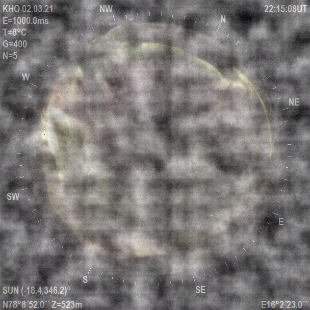
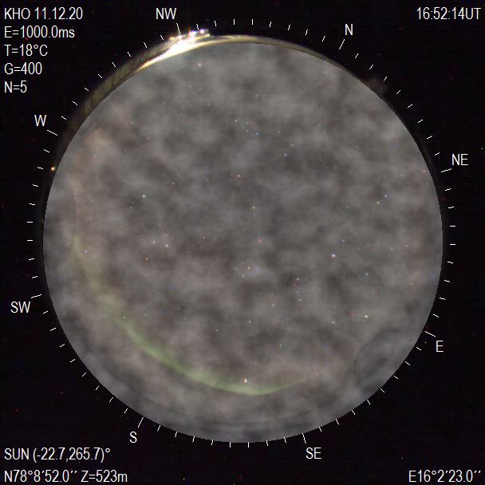
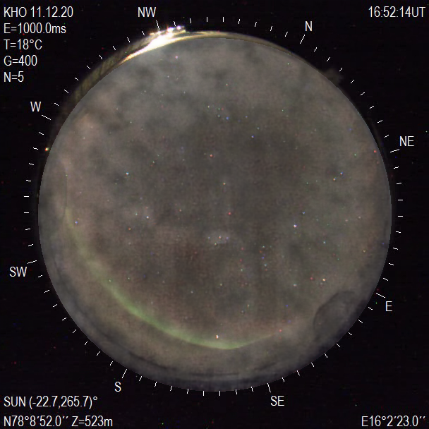

#+title: Boredealis
#+author: Jason

Using machine learning to remove clouds from a video of the Aurora Borealis.

* Methodology

So vision transformers are really meant for image classification. Time to learn a new technology! Let's start with a U-Net and work from there.

@TODO:
1. Go from videos to images
   - FFmpeg can do this: ~ffmpeg -i input.avi output_%04d.png~
   - Done (for now)
2. Get all of the data of clear skies, put them in a train directory, and prepare the images for training (done?)
3. Model to train (done)
   - Includes two transforms in the dataloader:
     - one for clear data (i.e. it's unmodified) (done?), and
     - one for clouds (i.e. it's faking clouds over the same image) (Randy) (done)
4. A script to take a video, make it a bunch of images (done), then chunks(?), then enhance (done), then reverse the process (not done)
5. A . . . GUI? Nah, I'm a backend dev (or like to think I am). How about a CLI?
6. What about a bootstrap script?

The method by which I am training a model to remove clouds from the Borealis is by generating synthetic clouds with [[https://en.wikipedia.org/wiki/Perlin_noise][perlin noise]]. Then, a clear image gets clouds laid over the part that has the sky, and the clear image becomes the target. Rinse and repeat for a dataset of a million images.

* Randy and Randii

Randy is the official mascot of this project. Randy is the result of synthetic clouds and noise. Why is he named Randy? Because I am starting to go crazy.

#+CAPTION: Randy
#+NAME: Randy

Unfortunately, Randy was not up to the task for training the model, as Randy has the issue of covering the whole image. Thus, Randy's wife, Randii, stepped in to fill the gap. Why is she named Randii? I think you can figure it out.

#+CAPTION: Randii
#+NAME: Randii

* Results

Here is the result of passing Randii through a model trained after 4 epochs, with a validation loss of 0.0116:

#+CAPTION: Synthetic image declouded with a model trained after 4 epochs
#+NAME: Randii declouded

Pretty good, right? How about some "actual" cloudy images?

@TODO: show some results with actual images with clouds and whatnot.

* FAQ

** Where can I get some model weights?

@TODO: make the weights available. Somehow. Perhaps as a GitHub release? I don't know–I mean I need to do more research.

** How do I install it?

1. ~git clone https://github.com/pressjson/boredealis~ wherever.
2. ~cd~ into the newly created directory.
3. Recommended: ~python3 -m venv venv~ to make a virtual environment inside the project directory.
4. Recommended: ~source venv/bin/activate~ to go into the virtual environment. Do this every time you want to run this project, if you don't install the required packages system-wide (I do not recommend this, as I am a big fan of virtual environments and reproducibility).
5. ~pip install -r requirements.txt~ to install the requirements listed in ~requirements.txt~. If you have issues with torch, remove the venv (~rm -rf venv~), make a new virtual environment, install torch and torchvision /first/, and then install the requirements.
6. Have fun?

** How do I use custom images rather than the default ones?

For now, pass the image into ~test.py~ as a custom argument, i.e. ~test(image_path="path/to/image")~ inside a python interpreter, or edit the file to include your custom path. I'm sorry there is no good way to do this.

@TODO: add an interactive menu.

@TODO: the CLI.

** How do I make local settings? Why does a warning about no local settings keep appearing?

Create a copy of ~settings.py~ and name it ~local_settings.py~. I would not change the image size. This should fix the warnings from appearing.

@FIXME: seeing the warning for no local settings found appearing twice when running ~test.py~. I do not care to fix this. (It's as simple as removing the warning statement from ~test.py~, relying only on the statement when it imports ~network.py~).

@FIXME: there is no default model. As such, ~test.py~ will not work.

@TODO: add a default model such that ~test.py~ works. Unfortunately, I can not put it in the repository by default, so it has to be a part of the releases. Plus, with the test folder, this repo is already too large.

@TODO: move the test folder to the releases page.

** ~ffmpeg_wrapper.py~ does not work. Why?

~ffmpeg_wrapper.py~ is, well, a wrapper function for [[https://ffmpeg.org/][FFmpeg]]. As such, you need to install FFmpeg on the system and ensure it is a part of $PATH.

** It doesn't work!

Are you in the virtual environment?

Did you change something?

Are you suffering from a skill issue?

It's okay.

I suffer from a skill issue as well.

Are you on Windows? I have not tested it on Windows.

@TODO: test it on Windows.

Is there a bug? Like an honest-to-God moth in my code? If so, please report it.
