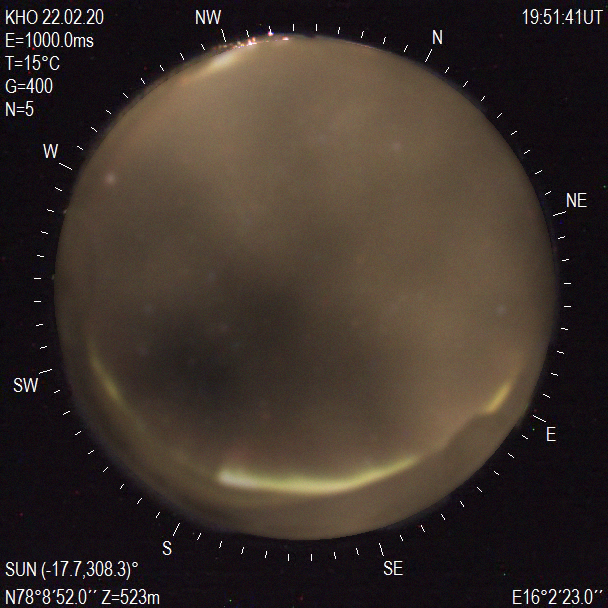
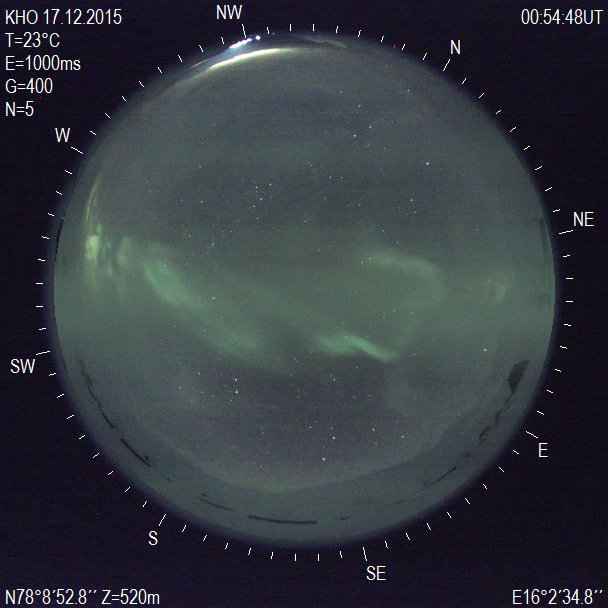
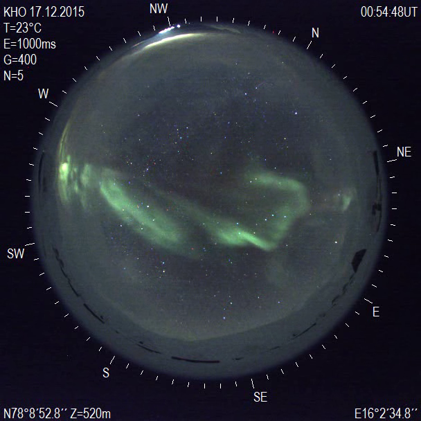
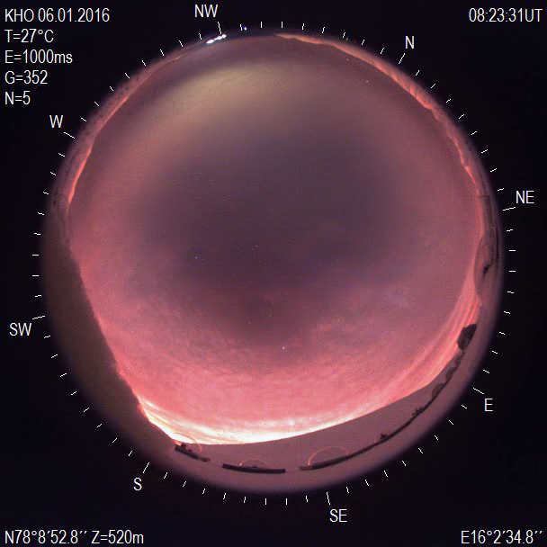
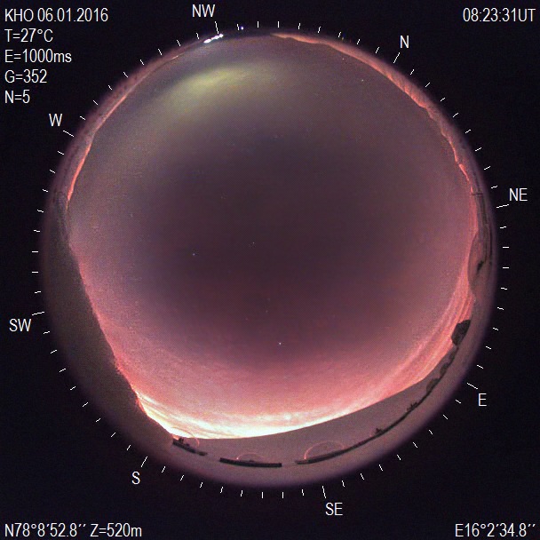
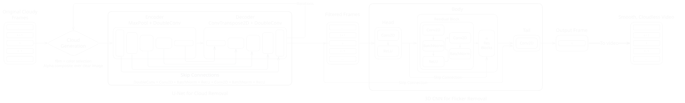

#+title: Boredealis
#+author: Jason

Using machine learning to remove clouds from a video of the Aurora Borealis.

* A Letter to the Future Maintainers

#+begin_quote
[!TIP]
Throw on some Philip Glass for this one. Mishima is good.
#+end_quote

Well, this is it for me. It's time to let my baby go. She grew up so fast.

I just have a few things to say.

** Chat

I have but one actual request:

*Please don't let this become a vibe coded project.*

Some "agentic engineering" is fine for the bullshit that is not fun to do. Just don't let Claude Code get its grimy little hands on this. You can ask Chat for things, but I urge you to write the code by hand, to use your /dinkum thinkum/ and not Sam Altman's. "It's a learning experience" is true.

You should have fun with this. The same fun I had with this.

** Ficus

Everything *should* just work with Ficus. Ask Dr. Scalzo for access, or use the fancy new one whose name I do not know. Don't waste cloud compute credits on this.

If you want my workflow, I have my development local, using Emacs on my files. I set up a [[https://mutagen.io/][Mutagen project]] with ~sync: <project_name>: mode: one-way-safe~ in a ~mutagen.yml~ to copy over my file edits to Ficus, and then have a Ficus shell for running tests. ~nohup~ will be your best friend for starting long projects.

** Loonix

I hope you're familiar with your terminal. If not, get used to it. It seems scary at first, but then you realize it's actually quite potent. But you should already know this, right?

There are tools to make living in the command line awesome, like [[https://github.com/ajeetdsouza/zoxide][zoxide]], [[https://github.com/tmux/tmux/wiki][tmux]] or [[https://zellij.dev/][zellij]], and [[https://github.com/nvbn/thefuck][The Fuck]]. The stock shell can be miserable, but it becomes so awesome as soon as you get used to it.

If you /can/ install Linux on your Windows machine, I would recommend doing that. "bUt mY gAmInG" get off CoD, realize that Wine 11.0 is actually faster than Windows 11, and enjoy non-competitive games (source: a Deadlock player); or dual boot. It turns out some FOSS projects are really, /really/ good. Like Linux. If you can't live without [[https://microslop.com/][Microslop]] and can't dual boot, then at least use WSL.

macOS is fine. Zsh is a good default shell, their laptops feel good, and Apple Silicon is basically magic. Enjoy paying [[https://git-fork.com/][$60 for a lazygit wrapper]] (for real tho, no shade to Fork, it's cool I guess. It's just a shame most software costs money on macOS, and don't get me started on the iPad).

** Vision

I'm the kind of programmer that lives in the terminal and Doom Emacs, because I can't quite make the leap to Neovim. Some things like Org and ~M-x fireplace~ are just too good to give up, but Vim (~h/j/k/l~) and leader keybindings (~SPC f s~) are life changing (I find myself trying to use them literally everywhere, like Google Docs).

If you want to make a website, go for it. Use WebGPU and whatever bullshit Javascript framework is the flavor of the week, or burn money renting cloud GPUs.

I urge you to please keep the TUI available. It's easier to pass flags rather than do every test as a drag and drop, especially with [[file:batch_video_filter.py][batch filtering videos]]. Plus, SSH-ing into Ficus is so much easier than trying to use it as backend infra.

** Understand What You're Doing

Talk to Old Man Fasel. He's a really good person to talk to, even if he sometimes hits really weird tangents. He understands absolutely nothing about AI, which is /perfect/ for testing your knowledge. When you inevitably write The White Paper™, you /will/ absolutely need to be able to explain every aspect of this project and anything tangentially related to this project to beyond expert level, all the way back to fundamental principles. He is the perfect person to test this with.

Old Man Fasel has a treasure trove of wisdom. Dr. Scalzo has a repository of knowledge. There is some of my knowledge in here, specifically in [[file:white_papers/][the white papers]], and especially in the references within them. Before you start, spend a day reading and talking to them.

** What is .org? Why not .md?

[[https://orgmode.org/][Org mode]] is [[https://www.youtube.com/watch?v=XRpHIa-2XCE][not just a markup language]]. It is capable of so much more than what I'm using it for.

#+begin_src python :results output
print("Hello, world!")
#+end_src

#+RESULTS:
: Hello, world!

It can execute Python like a Jupyter notebook! If you're especially masochistic, you can replace Jupyter notebooks with Org Babel. And not just Python either.

#+begin_src C :includes <stdio.h>
int a = 1, b = 2;
printf("%d\n", a + b);
#+end_src

#+RESULTS:
: 3

Which is crazy. That's C. Being executed. In a text file. Kind of. Well, because Org is so powerful, it is theoretically possible to have an "RCE" in Org Babel, because you can write and execute arbitrary code.

#+begin_src shell :results output
source venv/bin/activate
python main.py -h
#+end_src

#+RESULTS:
#+begin_example
usage: main.py [-h] [--model MODEL]
               [--model-name {attention_unet,attentionunet,deep_unet,deeplab_v3_plus,deeplabv3plus,deepunet,edsr,fpn_unet,fpnunet,nafnet,rdn,res_unet,restormer,resunet,unet,unet_plus_plus,unetplusplus,unetpp}]
               [--input INPUT] [--output OUTPUT] [--debug] [--verbose VERBOSE]
               [--version] [--iterations ITERATIONS] [--blend BLEND]
               [--device DEVICE] [--smoother SMOOTHER]

options:
  -h, --help            show this help message and exit
  --model, -m MODEL     path to model
  --model-name {attention_unet,attentionunet,deep_unet,deeplab_v3_plus,deeplabv3plus,deepunet,edsr,fpn_unet,fpnunet,nafnet,rdn,res_unet,restormer,resunet,unet,unet_plus_plus,unetplusplus,unetpp}
                        override checkpoint model architecture
  --input, -i INPUT     input path (include extension)
  --output, -o OUTPUT   output path (include extension)
  --debug, -d           enable debug
  --verbose, -V VERBOSE
                        enable verbose
  --version, -v         show program's version number and exit
  --iterations, -I ITERATIONS
                        run the model ITERATIONS times, default 1
  --blend BLEND         the amount of alpha to use "DDPM" with, default 0.0
  --device DEVICE       use custom device DEVICE
  --smoother, -s SMOOTHER
                        path to smoother model; if none, no smoothing
#+end_example

That's just a full on shell command.

Tables are also incredibly powerful, with more capability than Excel because you can use Lisp to make functions as cells. I can export this as a PDF using ~M-x org-latex-export-to-pdf~, which is what I wrote all of my Physics 210 lab reports in.

I just like Org a lot more than Markdown. It's so cool. I'm just scratching the surface. At the lightest, it's just a Markdown alternative. At the heaviest, it's as if Notion and Obsidian had an open source baby (Obsidian isn't open source).

Do you need Emacs to use Org mode? Probably not. Should you use Doom Emacs? Yes. Am I biased? Also yes.

** Alla fine

Ultimately, it's no longer my project. It's in your hands now.

Take care of her.

Goodbye, darling.

* What's left to do?

1. Test /everything/
2. Try the different model architectures
3. Improve clouds?
4. Write the paper
5. Profit

* Methodology

The method by which I am training a model to remove clouds from the Borealis is by generating synthetic clouds with [[https://en.wikipedia.org/wiki/Perlin_noise][Perlin noise]]. Then, a clear image gets clouds laid over the part that has the sky. The clouded image becomes the input, and the clear image becomes the target. Rinse and repeat for a dataset of a million images.

** Making synthetic clouds

Randy is the official mascot of this project. Randy is the result of synthetic clouds and noise. Why is he named Randy? Because I am starting to go crazy.

#+CAPTION: Randy
#+NAME: Randy
[[./readme_images/Randy.png]]

** Initial improvements: cropping

Unfortunately, Randy was not up to the task for training the model, as Randy has the issue of covering the whole image. Thus, Randy's wife, Randii, stepped in to fill the gap. Why is she named Randii? I think you can figure it out.

#+CAPTION: Randii
#+NAME: Randii
[[./readme_images/Randii.png]]

** Improving the clouds further: color and blur

Unfortunately, Randii has shortcomings. Chiefly, she does not properly simulate cloud hazing, where clouds blur and scatter the light source behind it. Additionally, clouds are not just black and white, but rather a color based on the source of the light behind it. Randthree improves on his parents Randy and Randii by using two random colors within the crop circle, adding a boost in brightness to one and subtracting from the other, and sets those as the lower and upper bounds of the Perlin noise generated clouds. To simulate light scattering, a random amount of [[https://en.wikipedia.org/wiki/Gaussian_blur][Gaussian blur]] gets applied to the cloudy part of the image. I do not want to write out the algorithm used here formally. Check the code, or the paper whenever that gets done.

#+CAPTION: Randthree
#+NAME: Randthree

Initially, I wanted to make one where the bounds get randomly selected from a file of hex colors, but this generated weird instances of magenta clouds on perfectly blue days, where there is no magenta in the scene (which /can/ happen naturally, from a sunset, for example).

** Better image loss: VGG

Up to this point, I was using L1 Loss (MAE). It is fast in compute time, and allows me to run a batch size of 7 per GPU on the school server (8x Nvidia A5000 GPUs) with the 128 filter model. L1 penalizes both large and small discrepancies, resulting in a "sharper" image compared to MSE Loss (which does not punish small discrepancies as heavily).

However, VGG Loss ([[https://arxiv.org/pdf/1609.04802v5][Perceptual Loss]]) more closely simulates image-to-image comparisons. The math is over my head, but it uses a pretrained neural network (VGG16) to compute loss in a more accurate manner than simple pixel-per-pixel comparison. It's really fascinating stuff.

The only problem with using a neural network to calculate the loss of a neural network is the amount of VRAM it takes. This means I have to dedicate one GPU to running VGG, meaning I can /only/ use seven A5000 GPUs to train. And no, I am not touching DistributedDataParallel() with a ten foot pole if I absolutely do not have to.

** RandIV

What if the clouds looked more realistic? And had a changing alpha? Introducing RandIV, the fourth iteration of synthetic clouds. These synthetic clouds have two major improvements: functional Brownian motion (fBm), and a non-constant alpha.

fBm is combining multiple layers of Perlin noise together. I do this recursively. The new color of the clouds is a weighted average of random Perlin noise maps, where each recursive call gets half the weight of the previous call, and then clamped to the range [0, 1].

To make clear patches, the alpha channel of the fBm color becomes a Perlin noise map, scaled to the range [0, ALPLA_BOUND].

This creates a much more realistic looking synthetic cloud.

#+CAPTION: RandIV

#+CAPTION: RandIV Base

Of course, having to calculate multiple Perlin noise maps is computationally expensive. But it's worth it.

** Diffusion

No, I did not switch architectures.

I was sitting bored in Dr. Scalzo's class during the group presentations. One of the groups talked about putting car tires on images of cars. I started thinking about diffusion models. To get a realistic looking image, they iteravely apply Gaussian noise during each iteration.

/What if I did this? No way it would work, right?/ Surely /it wouldn't be some magic pill that just removes clouds./ So I slapped together a hacked version with no parameter tuning.

#+CAPTION: RandIV declouded on clouds

#+CAPTION: RandIV declouded on clouds, but with "diffusion"

/EXCUSE ME!?!?/

So yeah. It somehow works. It works better on more than just this example. It works better on my entire testing dataset. Blessed be.

So far, the following parameters appear to be best by visual inspection:
- 64 filters: 0.2-0.35
- 96 filters: 0.2-0.6
- 128 filters: 0.2-0.5

The next step is to use proper metrics on the training data.

** Smoother

#+BEGIN_QUOTE
It's great, but *the flicker hurts my head*. - Gerard Fasel, 2025
#+END_QUOTE

#+CAPTION: A filtered but flickery GIF
[[file:readme_images/filtered_04122019_085304_checkpoint_best.gif]]

So how do we solve AI's problems? That's right, more AI! Hasn't that worked out so well for Microsoft?

The simplest architecture to achieve this is a 3D CNN. After all, "keep it simple, stupid" has done wonders thus far. It has a head, body comprised of residual blocks, and a tail. It has a window where it takes in frames ~t-i,...,t,...,t+i~ and returns a smoothed ~t~.

And you know the best part?

/It works/. At least with a three frame window, 8 residual blocks and 96 hidden channels.

#+CAPTION: A smoothed GIF
[[file:readme_images/smooth_04122019_085304_checkpoint_best.gif]]

If you want to read my COSC 210 report (the class in which I developed this model), you can do so [[file:white_papers/COSC_210_Paper.pdf][here]].

** Everything Put Together

I made a fancy diagram for my AGU25 presentation. I want to show it off.

#+CAPTION: Fancy diagram.

I spent so long (ten minutes) in my highly advanced vector-based graphics editor ([[https://excalidraw.com/][Excalidraw]]) to make this beautiful graphic, so you better enjoy it.

* The White Paper

Hey, we got accepted to ISVC with Randthree! You can check out the white paper somewhere, whenever Springer gets around to publishing it. In the meantime, you can read it [[file:white_papers/ISVC_2025_Declouding_The_Aurora_Borealis.pdf][here]] if you are so inclined. If you even exist.

We're maybe working on writing /another/ white paper to send to /Nature/ (allegedly). More to follow later.

* Installing

I develop on Linux, using Arch (and Omarchy btw). I do not have a copy of Windows. As such, I do not know if any of this works on Windows. I am almost positive that my bash does not, because Windows uses ~\~ for directory navigation and the Unix-likes (Linux and macOS) uses the correct ~/~ for directory navigation. If you're using something else, you're above my paygrade.

@TODO: make this work on Windows.

@DONE, fuck Windows, use WSL.

** Prerequisites

- Python 3
  - I personally develop on the edge with Python, but I am sure it works with older versions of Python 3. I have tested this to as early as 3.10.x, and it works there.
  - ~pip~ to install the packages. You can try and live without ~pip~, but /good luck/.
  - ~venv~ for virtual environments. It's not /required/, but I highly recommend using a virtual environment. You can install packages globally if you can't ~venv~.

** Actually installing

- ~git clone https://github.com/pressjson/boredealis~ wherever.
- ~cd~ into the newly created directory.
- Download the models from the releases page. I'd put them in the project directory for convenience.

Then, you have two options:

*** Use the shell script

Hit 'em with a ~./bootstrap.sh~ after a ~chmod +x bootstrap.sh~. This sets up your virtual environment, because five commands is too difficult.

Requirements:
- ~venv~
- ~pip~
- ~curl~, probably.

If you want to have CUDA enabled, you may have to install PyTorch manually. You can find how to in [[https://pytorch.org/get-started/locally/][the PyTorch website]]. It's one command. I believe in you.

NOTE: this will make the virtual enviornment folder as ~venv~ by default.

#+begin_src shell
source venv/bin/activate # if not in the virtual enviornment already
pip3 uninstall torch torchaudio torchvision
# Use the appropriate command from https://pytorch.org/get-started/locally/ for your system
# For me, I use the following since I have an AMD graphics card with ROCm:
pip3 install torch torchvision torchaudio --index-url https://download.pytorch.org/whl/rocm6.3
#+end_src

PyTorch on macOS already comes with ~mps~, so no need to install anything fancy. Just remember to pass ~--device mps~ into the models.

*** Install the packages manually

1. Recommended: ~python3 -m venv venv~ to make a virtual environment inside the project directory.
2. Recommended: ~source venv/bin/activate~ to go into the virtual environment. Do this every time you want to run this project, if you don't install the required packages system-wide (I do not recommend this, as I am a big fan of virtual environments and reproducibility).
3. ~pip install -r requirements.txt~ to install the requirements listed in ~requirements.txt~.
   - If you have issues with PyTorch, remove the venv (~rm -rf venv~), make a new virtual environment, install PyTorch /first/ (follow the command for your system on [[https://pytorch.org/get-started/locally/][the PyTorch website]]), and then install the requirements.
4. Install the models from the releases page.
5. Have fun?

* FAQ

Well, I don't actually know if these are frequently asked because nobody has ever asked me these.

** How can I pass parameters into Boredealis?

Instead of sitting through the interactive TUI every time, you can skip it by passing in parameters:

#+begin_src bash
python3 main.py --input <input_file> --output <output_location> --model <model_path>
#+end_src

Do a ~python3 main.py --help~ for a full list of available flags.

#+begin_quote
[!IMPORTANT]
As far as I know, paths with spaces are NOT working. For example, this will /not/ work:

#+BEGIN_SRC bash
python3 main.py --input $HOME/My Documents/boredealis/input_video.mov \
    --output $HOME/My Documents/boredealis/output_video.mov \
    --model $HOME/My Documents/boredealis/model.pth
#+END_SRC

I don't know if escaping spaced characters works. But for the love of God, don't keep this project in a path that has spaces leading to it.

Depending on how tedious the solution is, I will not be fixing this issue.
#+end_quote

*** Do I have to type in the file paths every single time?

Not necessarily. Most terminal emulators support dragging and dropping files as a way to paste their paths. Up arrow is a great way to re-bring up your last used query/entry.

Usually copying a file (~C-c~) and pasting it (~C-V~) into the terminal also works. macOS's ~S-v~ (command/super + v) works with most terminals (in macOS) just fine, but most Linux terminals require ~C-V~ (control + shift + v) to paste into terminals. Omarchy (btw) supports ~S-v~ in terminals.

** Where can I get some models?

There are models available to download under the releases tab. Download a model (~.pth~ file) and use its path when prompted (or pass it in as a parameter with a flag).

*Beware that larger models are /quite large and VRAM intensive/.* Use at your own risk. If your computer shuts down, it is probably because your VRAM got too hot and your computer went into a safety mode. If this occurs, try underclocking your GPU (specifically its VRAM) to limit temperatures, or pre-emptively changing your GPU fans to 100% (I had to do this with my dying RX 6800 XT).

** How do I install some images/videos for testing?

A release containing two ~.avi~ videos and their corresponding folders of ~.png~ images is available in the releases tab.

Because I am a chaotic mess, these images are uniformly named within a directory, but not between directories. Just . . . beware.

I am /not/ allowed to distribute the full dataset, as it is private and collected in-house. Even putting up two files from it feels like I am violating some privacy laws or something. So don't ask.

** How do I make local settings? Why does a warning about no local settings keep appearing?

This is only necessary for /training/ models. If you just want to use the models, then this has no effect.

Create a copy of ~settings.py~ and name it ~local_settings.py~. I would not change the image size. This should fix the warnings from appearing.

If you want to be super lazy and never change any settings and just want the noises to go away, you can make a symbolic link between ~settings.py~ and ~local_settings.py~:

#+begin_src bash
ln -s settings.py local_settings.py
#+end_src

** It doesn't work!

Are you in the virtual environment? Or have the packages installed?

Did you change something?

Are you suffering from a skill issue?

It's okay.

I suffer from a skill issue as well.

Are you on Windows? Use WSL. I don't want to do Windows.

Is there a bug? Like an honest-to-God moth in my code? If so, please report it.
