#+title: Boredealis
#+author: Jason

Using machine learning to remove clouds from a video of the Aurora Borealis.

* Methodology

So vision transformers are really meant for image classification. Time to learn a new technology! Let's start with a U-Net and work from there.

@TODO: (fixed) (mostly)
1. Go from videos to images
   - FFmpeg can do this: ~ffmpeg -i input.avi output_%04d.png~
   - Done (for now)
2. Get all of the data of clear skies, put them in a train directory, and prepare the images for training (done?)
3. Model to train (done)
   - Includes two transforms in the dataloader:
     - one for clear data (i.e. it's unmodified) (done?), and
     - one for clouds (i.e. it's faking clouds over the same image) (Randy) (done)
4. A script to take a video, make it a bunch of images (done), then chunks(?), then enhance (done), then reverse the process (not done)
5. Convert the input video to polar coordinates to capture only the relevant information
6. A . . . GUI? Nah, I'm a backend dev (or like to think I am). How about a CLI?
7. What about a bootstrap script?
8. Store images in RAM instead of writing to disk
   - Pros: speed? I think I/O operations are making video test times incredibly long (~20 mins to filter a 2.5 minute video)
   - Cons: memory usage. ~1.5 GB of PNG images get saved to disk just decomposing a video. Could run into memory overflow issues
     - Solution: give a flag to use disk caching instead of RAM caching
       - Pros: flexibility across many systems, from my PC to my shitty MacBook Air
       - Cons: complexity.

@TODO: (for real) (maybe)
1. Implement a radial transform
   - Saves on computational efficiency
2. Make fancier clouds
   - Blender? Godot?
   - Prebake data pairs
   - Remake the dataloader to accept these data pairs

The method by which I am training a model to remove clouds from the Borealis is by generating synthetic clouds with [[https://en.wikipedia.org/wiki/Perlin_noise][Perlin noise]]. Then, a clear image gets clouds laid over the part that has the sky. The clouded image becomes the input, and the clear image becomes the target. Rinse and repeat for a dataset of a million images.

** Making synthetic clouds

Randy is the official mascot of this project. Randy is the result of synthetic clouds and noise. Why is he named Randy? Because I am starting to go crazy.

#+CAPTION: Randy
#+NAME: Randy
[[./readme_images/Randy.png]]

** Initial improvements: cropping

Unfortunately, Randy was not up to the task for training the model, as Randy has the issue of covering the whole image. Thus, Randy's wife, Randii, stepped in to fill the gap. Why is she named Randii? I think you can figure it out.

#+CAPTION: Randii
#+NAME: Randii
[[./readme_images/Randii.png]]

** Improving the clouds further: color and blur

Unfortunately, Randii has shortcomings. Chiefly, she does not properly simulate cloud hazing, where clouds blur and scatter the light source behind it. Additionally, clouds are not just black and white, but rather a color based on the source of the light behind it. Randthree improves on his parents Randy and Randii by using two random colors within the crop circle, adding a boost in brightness to one and subtracting from the other, and sets those as the lower and upper bounds of the Perlin noise generated clouds. To simulate light scattering, a random amount of [[https://en.wikipedia.org/wiki/Gaussian_blur][Gaussian blur]] gets applied to the cloudy part of the image. I do not want to write out the algorithm used here formally. Check the code, or the paper whenever that gets done.

#+CAPTION: Randthree
#+NAME: Randthree
[[file:readme_images/improved_synthetic_clouds.png]]

Initially, I wanted to make one where the bounds get randomly selected from a file of hex colors, but this generated weird instances of magenta clouds on perfectly blue days, where there is no magenta in the scene (which /can/ happen naturally, from a sunset, for example).

** Better image loss: VGG

Up to this point, I was using L1 Loss (MAE). It is fast in compute time, and allows me to run a batch size of 7 per GPU on the school server (8x Nvidia A5000 GPUs) with the 128 filter model. N1 penalizes both large and small discrepancies, resulting in a "sharper" image compared to MSE Loss (which does not punish small discrepancies as heavily).

However, VGG Loss ([[https://arxiv.org/pdf/1609.04802v5][Perceptual Loss]]) more closely simulates image-to-image comparisons. The math is over my head, but it uses a pretrained neural network (VGG16) to compute loss in a more accurate manner than simple pixel-per-pixel comparison. It's really fascinating stuff.

The only problem with using a neural network to calculate the loss of a neural network is the amount of VRAM it takes. This means I have to dedicate one GPU to running VGG, meaning I can /only/ use seven A5000 GPUs to train. And no, I am not touching DistributedDataParallel() with a ten foot pole if I absolutely do not have to.

* The part that I will put in a white paper

** Abstract

We trained a UNet to learn to extract the Aurora Borealis from ground-based videos. To manufacture training data, we generated synthetic clouds using Perlin noise for the shape of the clouds, and interpolated between two random colors picked from the scene with a color increase for the highs and a decrease for the lows. Then, we combined an image with a clear sky with these synthetic clouds to generate a "cloudy" image. The synthetic clouds over an image with a clear sky appears similar to days with clouds, while being computationally simple enough to generate when needed. We trained the UNet to remove the synthetic clouds. When given real cloudy data, the UNet effectively extracts the Aurora Borealis from cloudy days. The filtered image on a real day featured less clouds and featured a more clear Auroral structure when compared to the original image.

** Sources to cite

Perlin noise generation for clouds, by John C. Hart
[[https://dl.acm.org/doi/abs/10.1145/383507.383531]]

Perceptual Loss, by Christian Leidig, Lucas Theis, et. al.
[[https://arxiv.org/abs/1609.04802v5]]

U-Net: Convolutional Networks for Biomedical Image Segmentation, by Olaf Ronneberger, Philipp Fischer, and Thomas Brox
https://arxiv.org/abs/1505.04597

** Dataset

The AllSky Camera dataset is private and collected in house. However, all source code and our models are available on GitHub at https://github.com/pressjson/boredealis under an MIT license. Included in the GitHub repo are two videos from the AllSky Camera dataset that were not used in the training dataset, to validate results (both the MIT License and sample videos being publically available are subject to the approval of Fred, Dr. Fasel, and any other powers that may be).

** Methods

@TODO: REWRITE THIS SECTION

In order to remove clouds, we need a model to remove clouds from videos. The model architecture we chose to use is a U-Net, due to its ability to extract features without "hallucinating" in the manner modern generative-based ML models do. In order to use a U-Net on the dataset, we need to preprocess the dataset. Since a U-Net expects an image as an input, we turn the videos into a series of individual images and work with each image. For choosing the size of the U-Net, experimentation revealed the optimal amount of start filters to be 128 and the amount of down sampling sizes to be five. On the 608x608 images, this gives a bottleneck of \(19 \times 19 \times 2048\).

Passing the entire image into the model rather than cropping out the circular raw data would not yield better results. Instead, it would reduce the amount of time it takes for the model to filter a given image, as the main bottleneck in the system is filtering the image, by reducing the size of the image that gets filtered. A smaller image to filter would mean a smaller amount of compute requried to filter an image. However, the time gained in filtering just the center of the image gets lost to the time required to crop the image.

The traditional method for training computer vision image-to-image models is to distort the images in such a manner that accurately simulates clouds. The method for making data pairs relies on simulating clouds over clear days: the clear sky becomes the target image, and the clear sky augmented with synthetic clouds becomes the input image.

*** Generating synthetic clouds from Perlin noise

Matching real days with real clouds is impossible, because the Aurora is never exactly the same between two instances. This means the only way to make data pairs is to use some form of synthetic clouds. Since the model is large, we want to avoid the model overfitting the data by generating the clouds on the fly. As such, we did not pre-bake a training dataset of the Aurora with and without clouds at the same instance, using a 3D visual effects program like Blender.

A cloud is a collection of water vapor and droplets. When a photon hits a water droplet, it gets scattered or absorbed. This gives the cloud a color and an opacity. The color of the cloud is a combination of absorbed light, which appears white, and light that gets reflected from the scene. The density of the cloud gives it an opacity.

To get the density of the clouds, we use Perlin noise to describe the geometry of the cloud. Cloud generation in visual effects use Perlin noise to generate the geometry of the cloud \cite{Hart}. We make a world of Perlin noise the size of the input image, which is \(608\times608\).

To get the color of the clouds from a Perlin noise base, the program chooses two random points in the scene, within the field of view of the camera (i.e. not the metadata of the frame). This simulates the cloud having some component of light from the scene. Then, the lower value gets a random value subracted from the red, green, and blue values; and the upper value gets a boost in the red, green, and blue values. This simulates the cloud absorbing light and appearing white. The amount we subtracted and boosted was a random integer between 0 and 150, which seemed to give us the best results.

#+CAPTION: Function to get the upper and lower bounds
#+BEGIN_SRC python
# random_coordinate(image: PIL.Image.Image) -> list:
#     returns a random valid coordinate in image
# sum_of_vals(list) -> int:
#     returns the sum of values of the list
from PIL import Image
def get_bounds(image: PIL.Image.Image) -> tuple[tuple, tuple]:
    upper_bound = random_coordinate(image)
    lower_bound = random_coordinate(image)
    random_dimness = random.randint(0, 150)
    random_boost = random.randint(0, 150)
    if sum_of_vals(upper_bound) < sum_of_vals(lower_bound):
        lower_bound, upper_bound = upper_bound, lower_bound
    for i in range(len(upper_bound)):
        upper_bound[i] = max(upper_bound[i] + random_boost, 255)
    for i in range(len(lower_bound)):
        lower_bound[i] = min(lower_bound[i] - random_dimness, 0)
    return tuple[upper_bound], tuple[lower_bound]
#+END_SRC

To compare the upper and lower bound values, the sum of the red, green, and blue coordinates serves as a reasonable metric to judge how "bright" the color is. It is not robust, but we determined it to be sufficient through experimentation.

With these bounds, we linearly interpolate the color the cloud should be at a given point \(x, y\) in the image between the upper and lower bounds of the image for each red, green, and blue value based on the value of the corresponding pixel in the Perlin noise base. We use random numbers to make sure the noise is different each time we need to make an image.

#+CAPTION: Function to generate the synthetic clouds
#+BEGIN_SRC python
import numpy
import noise
def generate_perlin_noise_image(
    size=(608, 608),
    lower_bound,
    upper_bound,
    scale=random.uniform(30.0, 500.0),
    octaves=random.randint(2, 8),
    persistence=0.5,
    lacunarity=2.0,
) -> PIL.Image.Image:
    world = numpy.zeros((size, size))
    noise_base = random.randint(1, 10000)
    for x in range(size):
        for y in range(size):
            world[x][y] = noise.pnoise2(
                x / scale,
                y / scale,
                octaves=octaves,
                persistence=persistence,
                lacunarity=lacunarity,
                repeatx=size / scale,
                repeaty=size / scale,
                base=noise_base,
            )

    min_val = numpy.min(world)
    max_val = numpy.max(world)

    normalized_world = (world - min_val) / (max_val - min_val)

    r_low, g_low, b_low = lower_bound
    r_up, g_up, b_up = upper_bound

    pixels = numpy.zeros((size, size, 3), dtype=numpy.uint8)

    for x in range(size):
        for y in range(size):
            noise_val_norm = normalized_world[x][y]

            # Linearly interpolate each color channel
            r = int(r_low + abs(r_up - r_low) * noise_val_norm)
            g = int(g_low + abs(g_up - g_low) * noise_val_norm)
            b = int(b_low + abs(b_up - b_low) * noise_val_norm)

            pixels[x, y] = (r, g, b)

    return Image.fromarray(pixels)
#+END_SRC

Next, we stitch the synthetic clouds over the image with a clear sky. When combining the two images, we only overlay the synthetic clouds with the part of the image that has camera data. We achieve this by setting the alpha of the cloudy image to be 1 only in a center circle, as all of our data uses the same center circle. When we combine the images, we mimic cloud transparency by multiplying the alpha value of the cloudy image by a random amount between 0 and 1. We determined those values to be the best through experimentation.

The final step is to simulate the clouds scattering light. We simulate this scatter by applying a Gaussian blur with a random kernel size between 0 (i.e. no blur, as sometimes light clouds do not noticeably blur the background) and 4. We determined those values to be the best through experimentation.

The final result of all of these operations on an image with a clear sky is an image that appears to have clouds that appear convincing, randomly generated each time we need to use synthetic clouds.

#+CAPTION: A night with clear skies
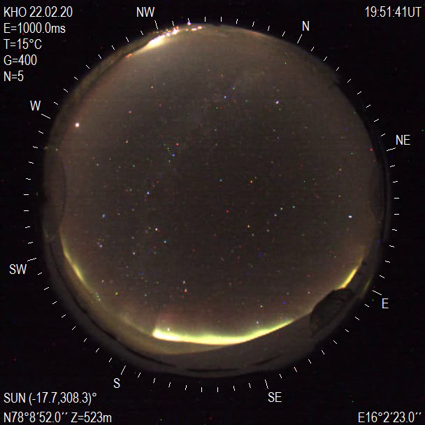

#+CAPTION: The same moment, with synthetic clouds
[[file:readme_images/improved_synthetic_clouds.png]]

#+CAPTION: What real clouds look like under similar conditions
@TODO: FIND THIS MOMENT

*** Model Architecture

For our use case, we decided a UNet best fits our application. UNets learn to extract features in images [Ronneberger, et. al]. The feature we want to extract in our images is the Aurora Borealis.

*** Model Training

We gave the model over one million images from over two hundred videos spanning ten years of hand picked AllSky Camera data with a clear sky. The model picks a random subset of two hundred thousand images to train on. From the training images, the model split the data into 80% training data and 20% validaiton data.

For both training and validation, we used two transforms on the same image. One transform only normalizes the image, and the other transform adds the clouds to the image before the image gets normalized. We only add synthetic clouds 80% of the time, to train the model to not remove clouds that do not exist on clear days.

#+CAPTION: The transforms for making clear-cloudy data pairs
#+BEGIN_SRC python
clear_transform = transforms.Compose(
    [
        transforms.Resize(settings.IMAGE_SIZE), # Safety check
        transforms.ToTensor(),
        transforms.Normalize(mean=[0.5, 0.5, 0.5], std=[0.5, 0.5, 0.5]),
    ]
)
cloud_transform = transforms.Compose(
    [
        transforms.Resize(settings.IMAGE_SIZE),
        RandomApplyTransforms(
            settings.IMAGE_SIZE,
            settings.RANDOM_APPLY_THRESHOLD,
            settings.NOISE_STRENGTH,
        ), # Randomly adds clouds to the image
        transforms.Normalize(mean=[0.5, 0.5, 0.5], std=[0.5, 0.5, 0.5]),
    ]
)
#+END_SRC

We used Perceptual (VGG) Loss to calculate loss. This gave us the best results through experimentation.

*** Training Data

For choosing what data to train the model on, we looked through all available data, and categorized each video as either "cloudy" or "clear." Clear videos feature no clouds in the center of the screen. Within each day, we chose two videos that were clear, but not right next to each other. If one video ended on a frame and the next video started on the next frame, this could lead to very similar looking images appearing in both the training and validation set of data, skewing the validation numbers. We also chose times that were random, to give the model a variety of conditions to train on, such as nighttime, sunrise, daytime, and sunset.

** Results

We trained a variety of model sizes: 96, 128, and 160 start filters for small, medium, and large respectively.

#+CAPTION: Value Loss versus Epochs of training
@TODO: GENERATE THE GRAPH

*** Results on Synthetic Clouds

* Results on still images

Here are some still images, used for testing throughout this process. In order, I refer to them as "clouds," "output_0258," "Randii," and "Synthetic clouds:"

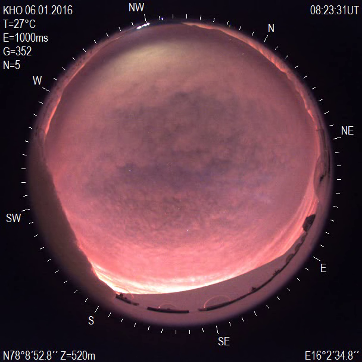
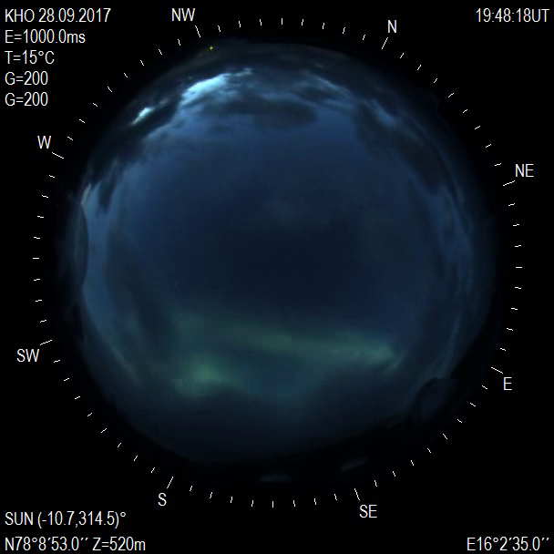
[[file:readme_images/Randii.png]]
[[file:readme_images/improved_synthetic_clouds.png]]

It is important to note that I /do/ have the base image for the synthetic clouds, which looks like this:

** Improved synthetic and VGG results

Using a model with 128 start filters, using VGG loss, I get these results over the four images:

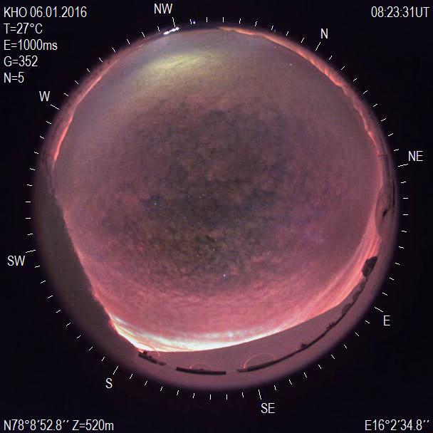
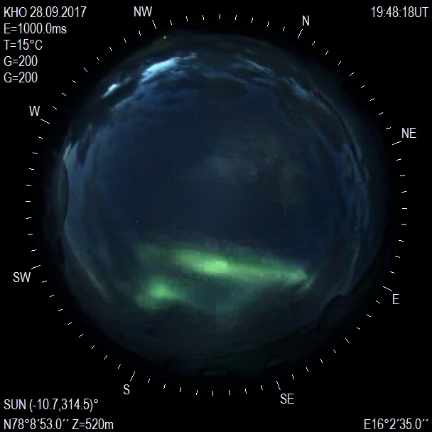[[
file:readme_images/randii_epoch_60.png]]
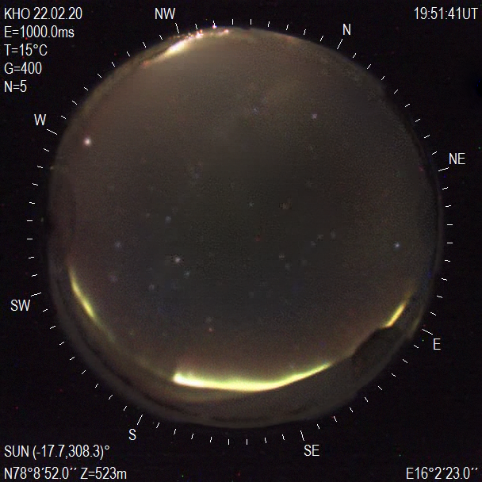

Some important things to note:

- It does make the clouds go away. Kind of.
- It can not make data appear out of apparently thin air.
  - This is because of how UNets work.
  - As such, it avoids hallucination
- It does a remarkable job with the synthetic data
- It does not perform as well on real data

My hypothesis is that stupid me uses silly synthetic clouds that are simple (and they have to be to allow for random clouds generated on the fly, avoiding overfitting a static dataset), and they do not appropriately approximate real clouds.

The next step for improving would be generating actual real clouds in a physics simulation, interacting with light from the sun, moon, and aurora. This approach involves using Blender (or some other 3d rendering program, I am not writing that from scratch for the scope of this project) to generate data pairs of the aurora, both with clouds and without clouds. Unfortunately, due to the fact that render times take eons, this means prebaking a dataset (i.e. no on the fly generation). Plus, I don't want to do that right now.

** Pre-VGG results

The following is out of date, as it uses basic L1 loss. I keep it around because it's interesting.

*** With synthetic clouds

Unfortunately, I do not have the original image of Randii before she got her glow-up. However, that does not mean it is still a good demonstration.

Here is the result of passing Randii through a model trained after 4 epochs, with a validation loss of 0.0116:

#+CAPTION: Synthetic image declouded with a model trained after 4 epochs
#+NAME: Randii declouded
[[./readme_images/Randii declouded by Epoch 4.png]]

And here is the result of passing Randii through a model trained after 1 epoch, with 128 filters:

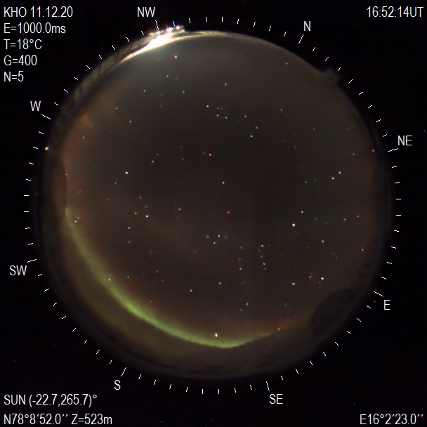

/Clearly/, the larger model is better at removing clouds than the smaller model. But what about actual clouds?

*** Near total coverage

Here is a cloudy image, where the clouds obscure the aurora somewhat:

Here is what happens when the smaller model filters the cloudy image:

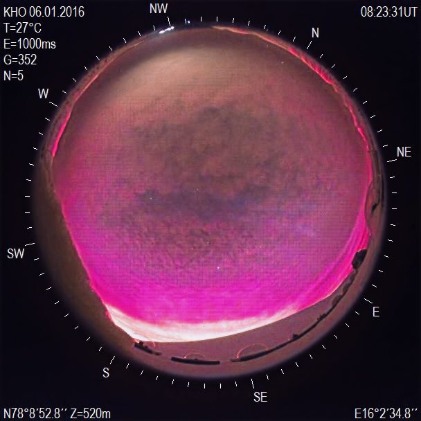

And with the larger model:

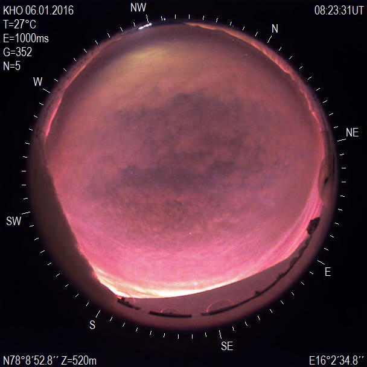

It's not perfect. Far from ideal, actually. Compared to the original, the 128 filter model maintains colors better, but the aurora is still obscured. Some of the sky in the middle is more visible and is clearer, but it is not the same night-and-day difference that the synthetic clouds have. Granted, the 128 filter model is still /very/ early in training.

*** Clouds partially obscuring the Aurora

Here is the Aurora, barely bleeding through some clouds:

It is visible, but it is partially hidden by the clouds. Does the model work with 64 filters?

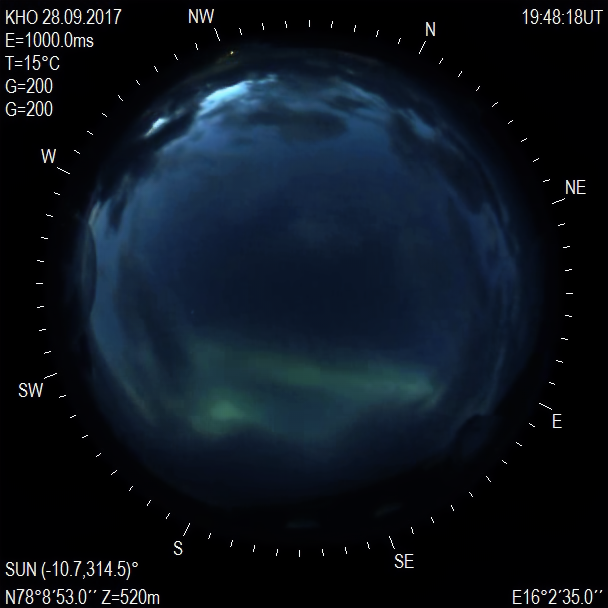

Kind of. But the real magic is with 128 filters:

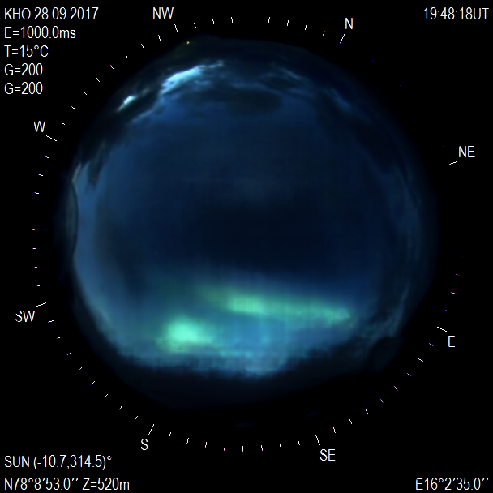

Look at how much clearer the Aurora is! It is the definition of night and day. It is not perfect, but it is still much better than the original video.

*** Putting a video together

The model filters images from a video. How does a video look generated (or put back together) from the filtered images? Here is an example video:

[[./readme_images/28092017_194355.avi]]

And here is the same video put through the pipeline with 128 filters:

[[./readme_images/28092017_194355.mp4]]

It's pretty incredible how much easier the aurora is to see.

* Installing

I develop on Linux, using Arch (btw). I do not have a copy of Windows. As such, I do not know if any of this works on Windows. I am almost positive that my bash does not, because Windows uses ~\~ for directory navigation and Unix (Linux, macOS) uses the correct ~/~ for directory navigation.

@TODO: make this work on Windows.

** Prerequisites

- Python3
  - I personally develop on the edge with Python 3.13.3, but I am sure it works with older versions of Python 3.
- A valid C compiler, like [[https://gcc.gnu.org/][GCC]]
- [[https://ffmpeg.org/][FFmpeg]] (now optional)
  - On macOS, FFmpeg is not natively installed. Install FFmpeg via [[https://brew.sh/][Homebrew]].
  - On Windows, just use WSL. It's now available on GitHub if you are that kind of nerd. Otherwise, just [[https://learn.microsoft.com/en-us/windows/wsl/install][install WSL]] and be forever happy.
    - If you want to use Windows, you will have to deal with Windows' weirdness in the terminal. As such, you will be building this project manually, and the shell script and my command syntax will not work.
- [[https://www.gnu.org/software/wget/][Wget]]
  - On macOS, Wget is not natively installed. Install Wget via [[https://brew.sh/][Homebrew]].

@TODO: migrate to curl, which is natively installed on macOS.

** Actually installing

- ~git clone https://github.com/pressjson/boredealis~ wherever.
- ~cd~ into the newly created directory.
- Download the models from the releases page, and place them in a new directory in the project root called ~model_milestones~.

Then, you have two options:

*** Use the shell script

~run.sh~ will bootstrap the virtual enviornment if it does not exist, enter into the virtual enviornment if it is not in one already, and then call ~main.py~ to start the project. I do not know if it works on Windows, but given that I call paths with the Unix style right now, it probably will not. If you are on Windows, I would recommend building the packages manually

~run.sh~ will also download the models in the releases tab into the models folder.

This does not support clicking on ~run.sh~ and having a new terminal window popping up, as the way to pop up a new terminal window is not standard, and I do not want to go through the pain of making a bash script to check every terminal emulator. And no, I will not be making a GUI.

If you want to have CUDA enabled, you will have to do the following:

#+begin_src shell
source venv/bin/activate # if not in the virtual enviornment already
pip3 uninstall torch torchaudio torchvision
# Use the appropriate command from https://pytorch.org/get-started/locally/ for your system
# For me, I use the following since I have an AMD graphics card with ROCm:
pip3 install torch torchvision torchaudio --index-url https://download.pytorch.org/whl/rocm6.3
#+end_src

PyTorch on macOS already comes with ~mps~, so no need to install anything fancy.

There is a similar command for Windows, but I do not develop on Windows (I use Arch btw).

*** Install the packages manually

1. Recommended: ~python3 -m venv venv~ to make a virtual environment inside the project directory.
2. Recommended: ~source venv/bin/activate~ to go into the virtual environment. Do this every time you want to run this project, if you don't install the required packages system-wide (I do not recommend this, as I am a big fan of virtual environments and reproducibility).
3. ~pip install -r requirements.txt~ to install the requirements listed in ~requirements.txt~. If you have issues with torch, remove the venv (~rm -rf venv~), make a new virtual environment, install torch and torchvision /first/ (follow the command for your system on [[https://pytorch.org/get-started/locally/][the Pytorch website]]), and then install the requirements.
4. Install the models from the releases page into a directory called ~models~.
5. Have fun?

* FAQ

** How can I pass parameters into Boredealis?

Instead of sitting through the interactive TUI every time, you can skip it by passing in parameters:

#+begin_src bash
# If running through python3 (if your system has python, that works as well)
python3 main.py <input_file_location> <output_file_name> <num_filters>
# If running via the shell script
./run.sh <input_file_location> <output_file_name> <num_filters>
# This also supports help and version
python3 main.py [help | --help | -h]
./run.sh [version | --version | -v]
#+end_src

@TODO: add extra flags, such as ~--input=[input]~ for the input, output, and filters; ~--no-clean-tmp~ or ~-n~; and whatever else is necessary.

This also supports only passing in one or two parameters. However, they /must/ be in the order ~[input] [output] [filters]~, so ~[input] [filters]~ does not work.

*** Do I have to type in the file paths every single time?

Not necessarily. Most terminal emulators support dragging and dropping files as a way to paste their paths. Up arrow is a great way to re-bring up your last used query/entry.

** Where can I get some models?

There are models available to download under the releases tab. Download a model (~.pth~ file), put it in the project's directory.

To use the models with the main script, place them inside a new directory called ~models~.

To use a model with ~test.py~, either:

- edit ~test.py~ to point towards the file;

#+begin_src python
# at the bottom of test.py
if __name__ == "__main__":
    test(
        # assuming the file is from the models page
        model_load_path=os.path.join("models", "64_checkpoint_best.pth")
    ).show()
#+end_src

- or just pass the file in as an argumennt.

#+begin_src python
>>> import test
>>> test.test(model_load_path = os.path.join("models", "64_checkpoint_best.pth"))
<PIL.Image.Image image mode=RGB size=608x608 at 0xADDRESS>
>>> test.test(model_load_path = os.path.join("models", "64_checkpoint_best.pth"))
# will show the image
#+end_src

*Beware that the 128 filter models and greater are /quite large and VRAM intensive/.* Use at your own risk. If your computer shuts down, it is probably because your VRAM got too hot and your computer went into a safety mode. If this occurs, try underclocking your GPU (specifically its VRAM) to limit temperatures, or pre-emptively changing your GPU fans to 100% (I had to do this with my dying RX 6800 XT).

** How do I install some images/videos for testing?

A release containing two ~.avi~ videos and their corresponding folders of ~.png~ images is available in the releases tab. Download the file(s) and extract them into a directory, such as ~test~.

Because I am a chaotic mess, these images are uniformly named within a directory, but not between directories. Just . . . beware.

If you choose to use these images, you will have to change the code to whatever you use.

I am /not/ allowed to distribute the full dataset, as it is private and collected in-house. Even putting up two files from it feels like I am violating some privacy laws or something.

** How do I use custom images/videos rather than the default ones with ~test.py~?

If you are wanting to tinker with ~test.py~, you are smart enough to modify the code to point to custom images.

For now, pass the image into ~test.py~ as a custom argument, i.e. ~test(image_path="path/to/image")~ inside a python interpreter, or edit the file to include your custom path. I'm sorry there is no good way to do this.

** How do I make local settings? Why does a warning about no local settings keep appearing?

This is only necessary for /training/ models. If you just want to use the models, then this has no effect.

Create a copy of ~settings.py~ and name it ~local_settings.py~. I would not change the image size. This should fix the warnings from appearing.

If you want to be super lazy and never change any settings and just want the noises to go away, you can make a symbolic link between ~settings.py~ and ~local_settings.py~:

#+begin_src shell
ln -s settings.py local_settings.py
#+end_src

@FIXME: there is no default model. As such, ~test.py~ will not work. The models are downloadable in the releases tab.

** ~ffmpeg_wrapper.py~ does not work. Why?

~ffmpeg_wrapper.py~ is, well, a wrapper function for [[https://ffmpeg.org/][FFmpeg]]. As such, you need to install FFmpeg on the system and ensure it is a part of $PATH.

** It doesn't work!

Are you in the virtual environment? Or have the packages installed?

Did you change something?

Are you suffering from a skill issue?

It's okay.

I suffer from a skill issue as well.

Are you on Windows? I have not tested it on Windows.

@TODO: test it on Windows.

Is there a bug? Like an honest-to-God moth in my code? If so, please report it.
